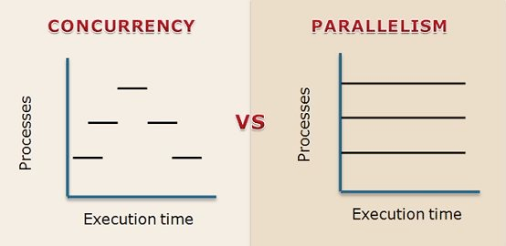
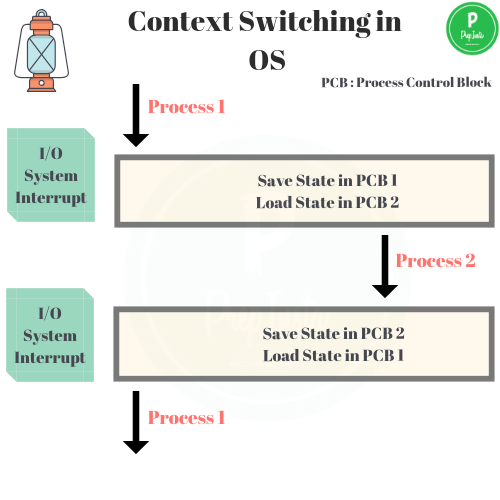
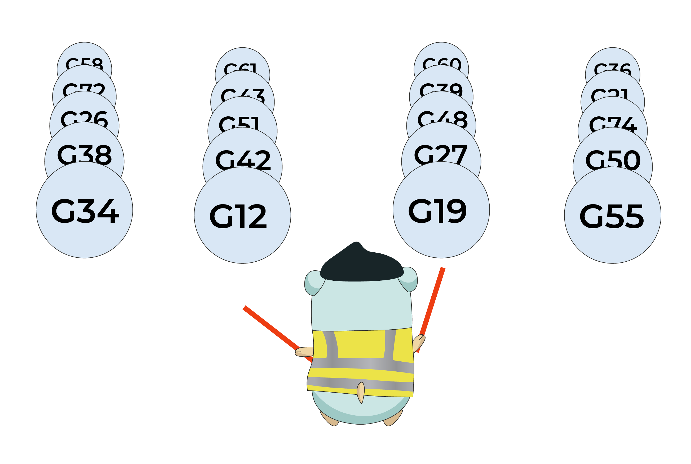
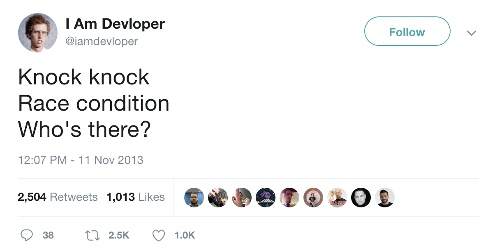

# Go course

## Advantages of `go`

1. Code runs fast (why it runs fast)
2. Garbage collector, some other languages that run fast as Go does they don't have garbage collection
3. Simpler object, object orientation is a little simplified as compared with other languages
4. efficient concurrency implementation built into language

## Code runs fast

Three categories of languages:

1. machine language - low level language and it's directly executed on the CPU (simple, small test. e.g. add, move, read
   from registry etc..)
2. assembly language - equivalent to machine language but easier to read. Map one-to-one the machine language (not
   completely but very close) equivalent, but you can read it because it's english. When you want to something very fast
   and really efficiently then you'll write it directly in assembly language.
3. high level language - everything else, they are much easier to use. Go is high level language!

> All software must be translated into the machine language of processor

If you've got a processor, i7 or whatever processor you're working with, that processor does not know C or Java or
Python or Go or C++ or any of those, right?  
All it knows is its own machine language, say x86 machine language. So C, Python, Java or whatever it is, has to be
translated. There is software translation step that has to go on:

1. **Compiled** - high level language to machine code happened one time before you execute the code. Translation occurs
   once, and when you run the code you are just running the machine code directly.
2. **interpreted** - instructions are translated while the code is excuted. So the translations occurs every time you
   run the Python code and so that slows you down.

Compiled code is generally faster to execute. Interpreters make coding easier: manage memory automatically and infer
variable types.

Go is a good compromise between compiled and interpreted languages, it is compiled language but it has some good
features of interpreted languages.

## Garbage collection

Automatic memory management

- where should memory be allocated?
- when can memory be deallocated?

Manual memory management is hard

- Deallocated too early, false memory access
- Deallocated too late, wasted memory

Go has garbage collector, downside is that it slows down exection a bit, but it is an efficient garbage collector.

## Objects

Go language is object-oriented -> weakly object-oriented. It implements objects but they have fewer features than you
would see in another object-oriented language.

### Object-oriented

- Object-oriented programming is for code organization (encapsulation).
- Group code together data and function which are related.
- User-defined type which is specific to an application.
    - generic type -> `ints` have data (the number) and functions (*, +, - etc.)
    - e.g. 3d geomtric applcication -> `point(x, y, z) { DistToOrigin(), Quadrant() }`  
      difference between object and class

### Object in Go

- does not use `class` but use `structs`
- simplified implementation of classes
    - no inheritance
    - no constructors
    - no generics

This makes it easier to code and it makes it efficient to run. But if you like these features this is a disadvantage.

## Concurrency

There are built-in constructs in the language that make it easy to use concurrency.

A lot of motivation for concurrency comes from the need for speed, not all.  
How concurrency get around these performance limitations.

### Performance limitation of computers

- Moore's Law used to help performance  
  number of transistors on a chip doubles every 18 months.
- more transistors used to lead to higher clock frequencies  
  Programmers would get lazy, because they knew that pretty soon hardware people would double the number of transistors
  and fixed all their problems for them, but that si not happening anymore, because Moore's Law had to slow down.
- Power/temperature constraints limit clock frequency now  
  So you can't keep increasing the clock rates.

How do you get performance improvement even though you can't just crank up the clock?

### Parallelism

- Increase number of cores
- you can perform multiple tasks at the same time
    - it does not necessarily improve your latency but your throughput will improve (potentially) 🤞
- Difficult with parallelism
    - when do tasks start/stop?
    - what if one task needs data from another task? How does this data transfer occur?
    - Do tasks conflicts in memory?  
      You do not want one task to write to its variable A and that overrides vairable B of another task. Code that can
      be executed in parallel can be difficult.

### Concurrency programming

- Concurrency is management of multiple tasks at the same time  
  They might not actually be executed at the same time (e.g. single core processor) but they are alive at the same time.
  So they could be executed at the same time if you had the resource.
- Key requirement for large systems  
  You want to be able to consider 20 things at one time.
- Concurrent programming enables parallelism
    - Management of task execution
    - Communication between tasks
    - Synchronization between tasks  
      So You can not just take a piece of regular code and say oaky I'm going to run it on 5 cores, that won't work. The
      programmer has to decide hot to partition this code (I want this data here and this data there etc.).  
      The program is making these decisions that allow these things to run in parallel.

### Concurrency in go

- Go includes concurrency primitives
- **Goroutines** represent concurrent tasks
- **Channels** are used to communicate between tasks
- **Select** enables task synchronization
- Concurrency primitives are efficient and easy to use

## Install Go

```brew install go```

## Workspaces and packages

### Workspace

Workspace is a directory where your Go stuff will go.

- hierarchy of directories
- Common organization is good for sharing  
  You never programming alone, you can work with people all over the place, and they have to be able to work with your
  code (merge, link, review, edit). So it is nice have a common standardized organization of your files.
- Three subdirectories
    1. src - Contains source code files
    2. pkg - Contains packages (libraries)
       Packages that you are going to link in that you need
    3. bin - Contains executables your compiled executables
- Directory hierarchy is recommended, not enforced.
- Workspace directory defined by **GOPATH** environment variable.

### Packages

- Group of related files
- Each package can be imported by other packages
- The first line of file names the package  
  `package mypackage`
  ```go
    import (
        mypackage
    )
  ```
- There must be one package called `main`  
  That's where the execution starts.
- Building the main package generate an executable program  
  when you build a non main package does not make it executable
- Main package needs have a function called `main()`
- `main()` is where code execution starts

## Go tool

### import

- `import` keyword is used to access other packages
- Go standard library includes many packages  
  i.e. "fmt" - printf statement
- Searches directories spefified by `GOROOT` and `GOPATH`
  if you import packages from some other place you have to change `GOROOT` and `GOPATH` so that it can find them

### Go Tool (CLI)

- Tool to manage Go source code
- Several commands
- `go build` - compiles the program  
  arguments can be a list of packages ora a list of `.go` files creates an executable for the main package, same name as
  the first `.go` file
- `go doc` - prints documentation for a package
- `go fmt` - format source code files
- `go get` - download packages and install them
- `go list` - list all the install packages
- `go run` - compiles go files and runs the executable
- `go test` - runs tests using files ending in `_test.go`

## Variables

- names must start with a letter
- any number of letters, digits or underscores
- case sensitive
- don't use keywords (`if`, `case`, `package` etc..)
- data stored in memory
- must have a **name** and a **type**.
  `var x int`
- can declare many on the same line
  `var x, y int`
- type defined the values a variable may take and operation that can be performed on it
- How much space in memory you are going to need to allocate for this variable
    - integer
    - floating point integer division is different from floating point division (depends on hardware)
    - Strings

- You can define an alias, an alternative name for a type, some time is useful for improve clarity.  
  e.g. `type Celsius float64` or `type IDnum int`
- you can declare variables using the type alias  
  e.g. `var temp Celsius` or `var pid IDnum`

### Variable initialization

- initialize in declaration `var x int = 100` or `var x = 100` - infer the type
- initialize after declaration `var x int` and then `x = 100`
- uninitialized variables have a zero value `var x int // x = 0` or `var x string // x = ""`
- Short variable declaration

`x := 100`

variable is declared as the type of expression on the right hand side  
Can only do this inside a function.

---

## Pointers

- Pointer is an address to data in memory

Two main operators that are associated with Pointers:

1. **&** operator returns the address of a variable/function
2. (*) operator returns data at an address (dereferencing) - If you put that in front of a Pointer to some address, put
   that in front of an address it will return you the data at that address.

**e.g.**

```go
var x int = 1
var y inst
var ip *int // ip is pointer to int

ip = &x // ip noi points to x
y = *ip // y is now 1
```

### New

- Alternate way to create a variable
- `new()` function creates a variable and return a pointer to the variable
- Variable is initialized to zero

```go
ptr := new(int)
*ptr = 3 // the value three is placed at the address specified by PTR
```  

## Variable Scope

- The places in code where a variable can be accessed

```go
var x = 4

func f() {
fmt.Printf("%d", x)
}
func g() {
fmt.Printf("%d", x)
}
```

```go
func f() {
var x = 4
fmt.Printf("%d", x)
}
func g() {
fmt.Printf("%d", x)
}
```

Function `g` will have no reference to `x`.

### Blocks

- A sequence of declarations and statements within matching brackets, {}
- Hierarchy of implicit blocks also
    - Universe block - all go source
    - Package block - all source in a package
    - File block - all source in a file
    - "if", "for", "switch" - all code inside the statement
    - Clause in "switch" or "select" - individual clauses each get a block

There implicit blocks that you do not have to put explicit curly brackets for.

### Lexical Scoping

- Go is a lexical scoped language using blocks
  `bi >= bj` if `bj` is defined inside `bi`

## Deallocating Memory

Once you declare a variable and your code is running your space needs to be allocated somewhere in memory for that
variable, at some point that space has to be deallocated. When you're done using it all right.

- When a variable is no longer needed, it should be deallocated
    - memory space is made available
- Otherwise, we will eventually run out of memory

```go
func f() {
var x = 4
fmt.Printf("%d", x)
} 
```

Now say you call in your program you call this function `f` 100 times right, then it's going to allocate 100 different
spaces for this variable X right.

### Stack vs Heap

- stack is dedicated to function call
    - local variables are stored here
    - deallocated after function completes (Go changes this a little bit)
- Heap is persistent
    - Data on the heap must be deallocated when it is done being used
    - in most compiled language (i.e. C) this is done manually
      `x = malloc(32)` and `free(x)`
    - Error prone, but fast

## Garbage collector

- hard to determine when a variable is no longer use you do not want to deallocate a variable and later need that
  variable that you deallocated

```go
func foo() *int {
x := 1
return &x
}

func main() {
var y = *int
y = foo()
fmt.Printf("%d", *y)
}
```

This code is illegal in certain language, but it is legal in Go.  
When the function ends that variable x should be deallocated, but in this case it's not the case because is returning a
pointer to x. Pointers make it difficult ot tell when deallocation is legal and when it is not.

- In interpreted languages this is done by the interpreter
    - Java Virtual Machine
    - Python Interpreter Once it determines that a variable is definitely not used, there no more pointers, no more
      references to that variable then the garbage collector deallocates it.
- Easy for the programmer (Deallocating memory is a big headache)
- Slow (need an interpreter)
- Go is a compiled language with enables garbage collection
- Implementation is fast
- Compiler determines stack vs heap it'll figure out this needs to go heap, this needs to go to the stack and it'll
  garbage collect appropriately.
- Garbage collection in the background It slows things down a little bit but it is a great advantage

## Integers

- Generic int declaration
  `var x int`
- Different lengths and signs int8, int16, int32, int64, uint8, uint16, uint32, uint64 // can get larger you can control
  the integer size by specifying what size integer you want
- Binary operators Arithmetic: =, -, *, /, %, <<, >>
  Comparison: ==, !=, >, <, >=, <= Boolean: &&, ||

### Type conversions

```go
var x int32 = 1
var y int16 = 2
x = y // this instruction will fail, because x and y have different types

x = int32(y)
```

## Floating point

Real numbers

- float32 - ~6 digits of precision
- float64 - ~15 digits of precision

```go
var x float64 = 123.45 // decimal
var y float64 = 1.2345e2 // scientific notation
```

- complex numbers rapresented as two floats: real and imaginary

```go
var x complex128 = complex(2, 3)
```

## String

### ASCII and UNICODE

Each character has to be coded according to a standardized code.

- American Standard Code for Information Exchange
- Each character is associated with an (7) 8-bit number
  'A' = 0x41 ASCII can represent 256 possible characters
- Unicode is a 32-bit character code
- UTF-8 is a sub set of Unicode. It can be 8-bit but it can go up to 32-bit. The first set of UTF-8 match ASCII
- Default in `go` is UTF-8
- Code points - Unicode characters
- Rune - code point in `go`

String are arbitrary sequence of bytes rapresented in UTF-8

- Sequence of arbitrary bytes
    - Read-only, you cannot modify a string, you can create a new string that is a modified version of existing string
    - often meant to be printed
    - String literal - notable by double quotes `x := "Hi there"`
      Each byte is a rune (UTF-8 code point)

The `rune` type is an alias for `int32`, and is used to emphasize than an integer represents a code point.

## Unicode package

- Provides a set of functions to test categories of runes
  `isDigit(r rune)`
  `isSpace(r rune)`
  `isLetter(r rune)`
  `isLower(r rune)`
  `isPunct(r rune)`
- Perform conversions
  `toLower(r rune)`
  `toUpper(r rune)`

## Strings package

- Functions to manipulate UTF-8 encoded strings
    - compare
    - contains
    - hasPrefix
    - index

### String manipulation

- Strings are immutable, but modified strings are returned
    - replace
    - toLower
    - toUpper
    - trimSpace

### Strconv package

- conversion to and from string representations of basic data types
    - `Atoi(s)` convert string s to int
    - `Itoa(s)`
    - `FormatFloat(f, fmt, prec, bitSize)`

## Constants

- Expression whose values is known at compile time
- Type is inferred from righthand side

```go
const x = 1.3
const (
y = 4
z = "Hi"
)
```

### iota

- `iota` is a function to generate constants, it generates a set of related but distinct constants.
- Often rapresents a property which has several distinct possible values
    - e.g. days of the week
    - e.g. months of the year
- Constants must be different but actual value is not important
- Like enumerated type in other languages

```go
type Grades int
const (
A Grades = iota
B
C
D
F
)
```

- Each constants is assigned to a unique integer
- Starts at 1 and increments

## Control flow

Control Flow describes the order in which statements are executed inside a program.

### Control Structures

Statements that alter control flow

### `if`

```go
if x > 5 {
fmt.Printf("Yup")
}
```

### `for`

iterates while a condition is true

```go
for i := 10; i < 10; i++ {
fmt.Printf("Hi")
}
```

### `switch`

is a multi-way if statements

```go
switch x {
case 1:
fmt.Printf("case1")
case 2:
fmt.Printf("case2")
default:
fmt.Printf("nocase")
}
```

- The `case` automatically breaks at the end of the case

- Normal switches have a tag, but sometimes switch may not contain tag.
- Case expression contains a boolean expression to evaluate
- First true case is executed

```go
switch {
case x > 1:
fmt.Printf("case1")
case x < -1
fmt.Printf("case 2")
default:
fmtp.Printf("nocase")
}
```

### `break` and `continue`

```go
for i := 0; i < 10; i ++ {
if i == 5 { break }
fmt.Printf("Hi ")
}
```

```go
for i := 0; i < 10; i ++ {
if i == 5 { continue }
fmt.Printf("Hi ")
}
```

### `scan`

- `scan` reads user input - it blocks the execution and waits until the user types in something and hits Enter
- Takes a pointer as an argument
- Typed data is written to pointer
- Returns the number of scanned items

```go
var appleNum int

fmt.Printf("Number of Apples: ")
num, err := fmt.Scan(&appleNum)
fmt.Printf(appleNum)
```

## Array

- fixed length series of elements of a chosen type
- element accessed using subscript notation `[`, `]` <-- index in the middle of the square brackets
- Indices start at 0
- Elements are initialized to zero value

```go
var x [5]int

x[0] = 2
fmt.Printf(x[1])
```

### Arrau literal

- array pre-defined with values
  `var x [5]int = [5]{1, 2, 3, 4, 5}`
- lenght of literal must be the same of array
- `...` for size in array literal infers size from number of initializers
  `x := [...]int{1, 2, 3}`

### Iterating through arrays

- user for loop with the range keyword

```go
x := [...]int {1, 2, 3}

for i, v := range x {
fmt.Prinf("ind %d, val %d", i, v)
}
```

- range returns 2 values: index and element at index

## Slice

- A "window" on an underlying array (a piece of it)
- Variable size up to the whole array

Every slice has three properties:

- Pointer: indicates the start of the slice
- Length: number of element in the slice
- Capacity: maximum number of elements

```go
arr := [...]string{"a", "b", "c", "d", "e", "f", "g"}

s1 := [1:3]
s2 := [2:5]  
```

- We use colon inside the square bracket to define the beginning and the ends of the slide
- The second slice includes c, d, e but not f. The second number after the colon is just after the end.
- Slice can overlap and refer the same element inside the underlying array

### Length and Capacity

- Two functions `len()` and `cap()`

```go
a1 := [3]int{1, 2, 3}
sli1 := [0:1]
fmt.Printf(len(sli1), cap(sli1))
// Result is "1 3"
```

### Accessing slices

- Writing to a slice changes the underlying array
- Overlapping slices refer the same array elements

```go
arr := [...]string{"a", "b", "c", "d", "e", "f", "g"}

s1 := [1:3]
s2 := [2:5]

fmt.Printf(s1[1])
fmt.Printf(s2[0])
// These 2 statements print the same thing
```

### Slice Literals

- Can be used to initialize a slice
- Creates the underlying array and creates a slice to reference it
- Slice points to the start of the array, length is capacity
- `sli := []int{1, 2, 3}` it is a slice because it does not have the array size or `...` keyword between the brackets

### Make

- Create a slice (and array) using make
- 2-argument version: type and length/capacity
  `sli = make([]int, 10)`
- 3-argument version: type, length and capacity separately
  `sli = make([]int, 10, 15)`
- The third argument is the size of the array

### Append

- Size of a slice can be increased by `append()`
- Adds elements to the end of the slice
- Insert into the underlying array, and it increases the size of the underlying array if necessary.

```go
  var sli = make (int[], 0, 3)
sli = append(sli, 100)
```

## Hash Table

- Contains key/value pairs - e.g. SSN/Email or GPS cord/address
- Each value is associated with a unique key
- Hash function is used to compute the slot for a key We can access things in constant time

### Tradeoff of Hash Tables

Advantages

- Faster lookup than list Constant time vs linear-time
- Arbitrary keys no int like slice or array

Disadvantages

- May have collision Two keys hash to same slot

## Maps

- Implementation of Hash Table
- Use `make()` to create a Map

```go
var idMap map[string]int
idMap = make(map[string]int)
```

- May define a map literal

```go
idMap := map[string]int{ "Joe": 3 }
```

### Accessing Map

- referencing a value with [key]
- Returns zero if key is not present
  `fmt.Printf(idMap["Joe"])`
- Adding key/value pair into the map
  `idMap["jane"] = 42`
- Delete key/value pair from the map
  `delete(idMap, "Joe")`

### Map functions

- Two-value assignment tests for existence of the key
  `id, p = idMap["Joe"]`  
  `p` is true if the key is present in the map
- `id` is the value, `p` is presence of key
- `len()` returns number of values
  `fmt.Printf(len(idMap))`

### Iterating Through a Map

- Use for loop with `range` keyboard
- Two-value assignment with range

```go
for key, value := range idMap {
fmt.Printf(key, val)
}
```

## Structs

- Aggregate data type
- Groups together other objects or arbitrary type Useful for organization purpose, it brings together variables that are
  releated e.g. Person struct
    - Name, Address, Phone

```go
type Person struct {
name string
address string
phone string
}
var p1 Person
```

- Each property is a field
- `p1` contains values for fields

### Accessing Structure fields

- Use dot notation

```go
p1.name = "Joe"
x = p1.address
```

### Initialize Structs

- Can use `new()`
- Initialize fields to zero (for `Person` structure this means that all fields are initialized with empty string)
  `p1 := new(Person)`
- Can initialize using a struct literal
  `p1 := Person{name: "joe", address: "a st.", phone: "123"}`

## Protocol format

- RFC Request for comments
- Definitions of internet protocols and formats
- Example protocols:
    - HTML (1866)
    - URI (3986)
    - HTTP (2616)

### Protocol package

- Golang provides packages for important RFCs
- Function that encode and decode protocol format e.g. net/http - web communication protocol
  `http.Get(www.uci.edu)`
  e.g. net TCP/IP and socket programming
  `net.Dial("tcp", "uci.edu:80")`

### JSON

- JavaScript Object Notation
- RFC 7159
- Format to represent structured information
- Attribute-value pairs
    - struct or map
- Basic value types
    - Bool, number, string, array, "object"

### JSON properties

- All unicode, all represented as unicode characters
- Human-readable
- Fairly compact representation
- Types can be combined recursively

### JSON Marshalling

- Generating JSON representation from an object

```go
type struct Person {
name string
addr string
phone string
}

p1 := Person(name: "Joe", addr: "a st.", phone: "123")

barr, err := json.Marshal(p1)
```

- `Marshal` returns JSON rapresentation as `[]byte`

### JSON Unmarshalling

```go
var p2 Person

err := json.Unmarshal(barr, &p2)
```

- `Unmarshal` converts a JSON `[] byte` into a Go object
- Object must "fit" JSON `[]byte`

## Files

- Linear access, not random access
    - Mechanical delay
- Basic operations
    1. Open - get handle for access
    2. Read - read bytes into `[]byte`
    3. Write - write `[]byte` into file
    4. Close - release handle
    5. Seek - move read/write head

### `ioutil` File Read

- "io/util" package has basic functions
  `dat, e := ioutil.ReadFile("test.txt")`
- `dat` is `[]byte` filled with contents of entire file
- Explicit open/close are not necessary
- Large files cause a problem

### `ioutil` File Write

```go
dat := "Hello, World"

err := ioutil.WriteFile("outfile.txt", dat, 0777)
```

- Writes `[]byte` to file
- Creates a file
- Unix-style permission bytes

### OS package File Access

- `os.Open()` opens a file
    - returns a file descriptor (File)
- `os.Close()` closes a file
- `os.Read()` reads from a file into a `[]byte`
    - fills the `[]byte`
    - control the amount read
- `os.Write` writes a `[]byte` into a file

```go
f, err := os.Open("dt.txt")
barr := make([]byte, 10)
nb, err := f.Read(barr)
f.Close
```

- Reads and fills `barr`
- `Read` returns # of bytes read
- May be less than `[]byte` length

```go
f, err := os.Create("dt.txt")

bar := []byte{1, 2, 3}
nb, err := f.Write(barr)
nb, err := f.WriteString("Hi")
```

## Functions

`main` function is a special function you never call this function, when you run the program the `main` function is
invoked and rum immediately.

```go
func PrintHello() {
fmt.Println("Hello, World")
}

func func main() {
PrintHello()
}
```

e.g. parameters and arguments

```go
func foo(x int, y int) {
fmt.Println(x*y)
}

func main() {
foo(2, 3)
}
```

List arguments of same type

```go
func foo(x, y int) { ... }
```

Return values

```go
func foo(x int) int {
return x + 1
}

y := foo(1)
```

Multiple return values

```go
func foo2(x int) (int, int) {
return x, x + 1
}

a, b := foo2(3)
```

### Call by value, reference

- Call by value
    - passed arguments are copied to parameters
    - Modifing parameters has no effect outside the function

```go
func foo(y int) {
y = y + 1
}

func main() {
x := 2
foo(x)
fmt.Println(x)
}
```

- Call by reference
    - Programmer can pass a pointer as an argument
    - Called function has direct access to caller variable in memory

```go
func foo(y *int) {
*y = *y + 1
}

func main() {
x := 2
foo(&x)
fmt.Println(x)
}
```

### Passing arrays and slices

- Arrays arguments are copied
- Arrays can be big, and this can be a problem

```go
func foo(x [3]int) int {
return x[0]
}

func main() {
a := [3]int{1, 2, 3}
fmt.Println(foo(a))
}
```

- Possible to pass array pointers

```go
func foo(x *[3]int) int {
(*x)[0] = (*x[0]) + 1
}

func main() {
a := [3]int{1, 2, 3}
foo(&a)
fmt.Println(a)
}
```

- Messy and unnecessary
- Pass slices instead!
- Slices contain a pointer to the array
- Passing a slice copies the pointer

```go
func foo(sli []int) []int {
sli[0] = sli[0] + 1
return sli
}

func main() {
a := []int{1, 2, 3}
foo(a)
fmt.Println(a)
}
```

## Functions

Function can be treated like other types

### First-Class Values

- Variable can be declared with a function type
- Can be created **dynamically**
- Can be passed as arguments and returned as values
- Can be stored in a data structures

### Variables as functions

```go
var funcVar func (int) int
func incFn(x int) int {
return x+1
}
func main() {
funcVar = incFn
fmt.Println(funcVar(1))
}
```

### Functions as Arguments

```go
func applyIt(afunct func (int) int, val int) int {
return afunct(int)
}

func incFn(x int) int { return x+1 }
func decFn(x int) int { return x-1 }

func main() {
fmt.Println(applyIt(incFn, 2))
fmt.Println(applyIt(decFn, 2))
}
```

### Anonymous Functions

Function without a name

```go
func applyIt(afunct func (int) int, val int) int {
return afunct(val)
}


func main() {
fmt.Println(applyIt(func (x int) int { return x+1 }, 2))
}
```

### Returning functions

```go
func MakeDistOrigin(o_x, o_y float64) func (float64, float64) float64 {
fn := func (x, y float64) float64 {
return math.Sqrt(math.Pow(x - o_x, 2) + math.Pow(y - o_y, 2))
}

return fn
}

func main() {
Dist1 := MakeDistOrigin(0, 0)
Dist2 := MakeDistOrigin(2, 2)

fmt.Println(Dist1(2, 2))
fmt.Println(Dist2(2, 2))
}
```

### Environment of a Function

- Set of all names that are valid inside a function
- Names defined locally, in the function
- Lexical scoping
- Environment includes names defined in the block where the function is defined

```go
var x int
func foo(y int) {
x := 1
}
```

### Closure

- Function + its environment
- When functions are passed/returned, their environment comes with them!

### Variable Argument Number

- Functions can take a variable number of arguments
- Use ellipsis ... to specify
- Treated as a slice inside the function

```go
func getMax(vals ...int) int {
maxV := -1
for _, v := range vals {
if v > maxV {
maxV = v
} 
}

return maxV
}
```

### Variadic Slice Arguments

```go
func main() {
fmt.Println(getMax(1, 2, 3, 4, 5))
vslice := []{1, 3, 6, 4}
fmt.Println(getMax(vslice...))
}
```

- Can pass a slice to a variadic function
- Needed the ... suffix

### Deferred function calls

- Call can be deferred until the surrounding function complete
- Typically, used for cleanup activities

```go
func func main() {
defer fmt.Println("bye!")

defer fmt.Println("Hello!")
}
```

### Deferred call arguments

- Arguments of a deferred call are evaluated immediately

```go
func func main() {
i := 1
defer fmt.Println(i+1)
i++
defer fmt.Println("Hello")
}
```

## Object-Orientation in GO

### Classes

- Collection of data fields and functions that share a well-defined responsibility
- Classes are a template
- Contains data fields, not data

### Object

- Instance of a class
- Contains real data

### Encapsulation

- Data can be protected from the programmer
- Data can be accessed only using methods
- Maybe we do not trust the programmer to keep data consistent

### No "Class" keyword

- Most of OO languages have class keyword
- Data fields and methods are defined inside a class block

### Associating methods with data

- Method has a **receiver type** that it is associate with
- Use dot notation to call the method

```go
type MyInt int

func (mi MyInt) Double () int {
return int(mi*2)
}

func main() {
v := MyInt(3)
fmt.Println(v.Double())
}
```

- Type must be defined in the same package as the method that you are associating with it

### Implicit method argument

- Object of receiver type is an implicit argument to the function
    - Call by Value

### Structs, again

- Struct types compose data fields

```go
type Point struct {
x float64
y float64
}
```

- Traditional feature of classes

### Structs with methods

- Structs and methods together allow arbitrary data and functions to be composed

```go
func (p Point) DistoToOrigin() {
t := math.Pow(p.x, 2) + math.Pow(p.y, 2)
return math.Sqrt(t)
}

func main() {
p1 := Point(3, 4)
fmt.Println(p1.DistToOrigin())
}
```

### Controlling data access

- Can defined **public function** to allow access to hidden data

```go
package data

import "fmt"

var x int = 1

func PrintX() { fmt.Println(x) }
```

```go
package main

import "data"

func main() {
	data.PrintX()
}
```

- public functions inside the package have to start with a capital letter

### Controlling access to Structs

- Hide fields of structs by starting field name with lower-case letter
- Defined public methods which access hidden data

```go
package data

type Point struct {
	x float64
	y float64
}

func (p *Point) InitMe(xn, yn float64) {
	p.x = xn
	p.y = yn
}
```

- Need `InitMe()` to assign hidden data fields

```go
func (p *Point) Scale(v float64) {
p.x = p.x * v
p.y = p.y * v
}

func (p *Point) PrintMe() {
fmt.Println(p.x, p.y)
}

func main() {
var p data.Point
p.InitMe(3, 4)
p.Scale(2)
p.PrintMe()
}
```

- Access to hidden fields only through public methods

### Limitation fo methods

- Receiver is passed implicitly as an argument to the method
- Method cannot modify the data inside the receiver
- Example: `OffsetX()` should increase x coordinate

```go
func main() {
p1 := Point{3, 4}
p1.OffsetX(5)
}
```

#### Large receiver

- If receiver is large, lots of copying is required

```go
type Image [100][100]int
func main() {
i1 := GrabImage()
i1.BlurImage()
}
```

- 10.000 ints copied to `BlurImage()`

### Pointer Receiver

```go
func (p *Point) OffsetX(v float64) {
p.x = p.x + v
}
```

- Receiver can be a pointer to a type
- Call by reference, pointer is passed to the method
- No need to dereference, Point is referenced as `p` not `*p`
- Dereferencing is automatic with `.` operator
- Do not need to reference when calling the method e.g. `p.ScaleX(3)`

### Using Pointer Receivers

- Good programming practice:
    1. All methods for a type have pointer receivers, or
    2. All methods for a type have non-pointer receivers
- Mixing pointer/non-pointer receivers for a type will get confusing
    - Pointer receiver allows modification

## Polimorphism

- Ability for an object to have different "forms" depending on the context
- Example: `Area()` function
    - Rectangle: area = base * height
    - Triangle: area = 0.5 * base * height
- Identical at a high level of abstraction
- Different al a low level of abstraction

**Go does not have inheritance**

## Interfaces

- Set of method signatures
    - Implementation is NOT defined
- Used to express conceptual similarity between types
- Example: Shape2D interface
- All 2D shapes mush have `Area()` and `Perimeter()`

### Satisfying an Interface

- Type satisfies an interface if type defines all methods specified in the interface
    - Same method signatures
- Rectangle and Triangle types satisfy the Shape2D interface
    - Mush have `Area()` and `Perimeter()` methods
    - Additional methods are ok
- Similar to inheritance with overriding

### Defining an interface type

```go
type Shape2D interface {
Area() float64
Perimeter() float64
}

type Triangle {...}
func (t Triangle) Area() float64 {...}
func (t Triangle) Perimeter() float64 {...}
```

No need to state it explicity

## Concrete vs Interface Types

### Concrete types

- Specify the exact representation of the data and methods
- complete method implementation is included

### Interface types

- Specifies some method signatures
- Implementations are abstracted

### Interface value

- Can be treated like other values
    - assigned to variables
    - passed, returned
    - Interface value has 2 components
        1. Dynamic type: Concrete type which is assigned to
        2. Dynamic value: Value of the dynamic type

        - Interface value is actually a pair (dynamic type and dynamic value)
- An interface can have a nil dynamic value

```go
var s1 Speaker
var d1 *Dog
s1 = d1
```

- d1 has not concrete value yet
- s1 has a dynamic type but not dynamic value
- Nil dynamic value - can still call the `Speak()` method of s1
- Does not need a dynamic value to call
- Need to check inside the method

```go
func (d *Dog) Speak() {
if d == nil {
fmt.Println("")
} else {
fmt.Println(d.name)
}
}

var s1 Speaker
var d1 *Dog
s1 = d1
s1.Speak()
```

### Nil interface value

- interface with nil dynamic type
- very different from an interface with a nil dynamic value
- e.g. `var s1 Speaker` cannot call a method, runtime error

## Empty interface

- Empty interfaces specifies no methods
- All types satisfy the empty interface
- Use it to have a function accept any type as parameter

```go
func PrintMe(val interface{}) {
fmt.Println(val)
}
```

## Type assertions

### Concealing type differences

- Interfaces hide the difference between types
- sometimes you need to treat different types in different ways

### Exposing type differences

- Exmaple: Graphic program
- `DrawShape()` will draw any shape
- Underlying API has different drawing functions for each shape
    - `DrawRect(r Rectangle) {...}`
    - `DrawTriangle(t Triangle) {...}`
- Concrete type of shape `s` must be determined

### Type assertions for disambiguation

- Type assertion can be used to determine and extract the underlying concrete type

```go
func DrawShape(s Shape2D) bool {
rect, ok := s.(Rectangle)
if ok {
DrawRect(rect)
}
tri, ok := s.(Triangle)
if ok {
DrawTriangle(tri)
}
}
```

- Type assertion extracts Rectangle from Shape2D (concrete type in parentheses)
- If interface contains concrete type
    - rect == concrete, ok == true
- If interface does not contain concrete type
    - rect == zero, ok == false

### Type Switch

- Switch statement used with a type assertion

```go
func DrawShape(s Shape2D) {
switch sh := s.(type) {
case Rectangle:
DrawRect(sh)
case Triangle:
DrawTriangle(sh)
}
}
```

## Error Handling

### Error interface

- Many Go programs return error interface objects to indicate errors

```go
type error interface {
Error() string
}
```

- Correct operation: error == nil
- Incorrect operation: `Error()` prints the error message

## Concurrency

Big property of Go language is that concurrency is built into the language.  
Compared to other languages like C and things or anything, Python, whatever, these languages you can do concurrent
programming in these languages, but it's not built into the language, which means, usually what you do is you import
some library.

### Parallel Execution

Concurrency and parallelism are two closely ideas.

- Two programs execute in parallel if they **execute at exactly same time**
- At time t, an instruction is being performed for both P1 and P2
  Generally, one core runs one instruction at a time.
  So, if you want to have actual parallel execution, two things running at the same time, you need two processors or at least two processor cores.
- Need replicated hardware

### Why use Parallel execution

- Tasks may complete more quickly (better throughput overall)
- Example: Two piles of dishes to wash.
  Two dishwasher can complete twice as fast as one
- Some tasks must be performed sequentially
- Example: Wash dish, dry dish
- Some tasks are parallelizable and some are not

### Why use concurrency? Speedup without Parallelism

- Can we achieve speedup without Parallelism?
- Designer faster processors
  - get speedup without changing software
- Design Processor with more memory
  - Reduces the Von Neumann bottleneck
  - cache access time = 1 clock cycle
  - Main memory access time =~100 clock cycles
  - Increasing on-chip cache improves performance

### Moore's Law

- Predicted that transistor density would double every 2 years
- Smaller transistors switch faster
- Not a physical law, just an observation
- Exponential increase in density would lead to exponential increase in speed

#### Power / Temperature Problem

- Transistors consume power when they switch
- Increasing transistor density leads to increased power consumption
  - Smaller transistors use less power, but density scaling is much faster
- High power leads to high temperature
- Air cooling (fans) can only remove so much heat

#### Dynamic Power

- `P = α * CFV^2`
- α is percent of time switching
- C is capacitance (related to transistor size)
- F is the clock frequency
- V is voltage swing (from lo to high)

- Voltage is important
- 0 to 5V uses much more power than 0 to 1.3V

#### Dennard Scaling

- Voltage should scale with transistor size
- Keeps power consumption, and temperature, low
- Problem: Voltage can't go too low
  - Must stay above threshold voltage (transistors have what's called a threshold voltage. Below a certain voltage, they cannot switch on)
  - Noise problems occur
- Problem: does not consider leakage power
- Dennard scaling must stop

### Multi-Core systems

- `P = α * CFV^2`
- Cannot increase frequency
- Can still add processor cores, without increasing frequency
  - Trend is apparent today
- Parallel execution is needed to exploit multi-core system
- Code made to execute on multiple cores
- Different programs on different core

### Concurrent Execution

- Concurrent execution is not necessarily the same as parallel execution
- Concurrent: start and end times overlap
- Parallel: executed at exactly the same time



### Concurrent vs Parallel

- Parallel tasks must be executed on different hardware
- Concurrent tasks may be executed on the same hardware
  - Only one task actually executed at a time
- Mapping from tasks to hardware is not directly controlled by programmer
  - At least not in go

### Concurrent Programming

- Programmer determines which tasks can be executed in parallel
- Mapping tasks to hardware
  - Operating system
  - Go runtime scheduler

So you're doing concurrent programming but you've only got one core, so you can't actually get parallelism.

### Hiding Latency

- Concurrency improves performance, even without parallelism
- Tasks must periodically wait for something
  - i.e. wait for memory, network, screen etc..
  - X = Y + Z read Y, Z from memory
  - may wait 100+ clock cycles
- Other concurrent tasks con operate while one task is waiting

**Parallel execution**
```
Task 1              Task 2
  |                   |
  |                   |
  |                   |
  v                   v
Core 1              Core 2
```


**Concurrent Execution**
```
Task 1              Task 2
  \                   /
    \               /
      \           /
        v       v
          Core 1
```

### Hardware Mapping in go

- Programmer does not determine the hardware mapping
- Programmer makes parallelism possible
- Hardware mapping depends on many factors
  - Where is the data?
  - What are the communication costs?

### Processes

- An instance of a running program
- things unique to a process
  1. Memory
    - virtual address space
    - Code, stack, heap, shared libraries
  2. Registers
    - Program counter, data regs, stack pointer

### Operating System

- Allows many processes to execute concurrently
- Process are switched quickly
  - 20ms
- User has the impression of parallelism
- Operating system must give processes fair access to resources


### Scheduling Processes

- Operating system schedules processes for execution
- Gives the illusion of parallel execution
- There are many scheduling algorithm, the simplest is Round robin
- OS gives fair access to CPU, memory, etc..

### Context Switch

- Control flow changes from one process to another
  
- Process "context" must we swapped

### Threads vs. Processes

- Context switch can be long, because it requires taking data, writing it to memory and then reading data from memory back into registers. So there is a lot of memory access and memory access can be slow.
- Thread share some context
- Many threads can exist in one process
- OS schedules threads rather than processes

### Goroutines

- Like a thread in Go
- Many Goroutines execute within a single OS thread



### Go Runtime Scheduler

- Schedules goroutines inside an OS thread
- Like a little OS inside a single OS thread.
  The OS schedules which thread runs at a time, then once the main thread is running, your Go program is runnining within main thread, the Runtime Scheduler can choose different Goroutine to execute at different times underneath that main thread.
- Logical processor (used by Runtime Scheduler) is mapped to a thread
  All these goroutines are running in one thread, no opportunity for parallelism, it's all concurrent.
  But, as programmer we can choose how many Logical processor we want, and we would do this according to how many cores we had.

### Interleavings

- Order of execution within a task is known
- Order of execution between concurrent tasks is unknown
  Means that two sets of instruction from two different task can be interleaved in different ways.
- Interleaving of instructions between tasks is unknown
  - Many interleaving are possible
  - Must consider all possibilities
  - ordering is non-deterministic

### Race conditions

- Outcome depends on non-deterministic ordering



- Races occurs due to communication

### Communication between tasks

- Threads are largely independent but not completely independent
  It is very common there is some level of sharing between threads, and the sharing of information is communication.
  - Web Server, one thread per client
  - Image processing, 1 thread per pixel block

### Creating Go Routine

- One goroutine is created automatically to executre the `main()`
- Other goroutines are created using the `go` keyword

```go
a = 1
go foo()
a = 2
```

- New goroutine created for foo()
- Main goroutine does not block

### Exiting a Goroutine

- A goroutine exits when its code is complete
- When the main goroutine is complete, all other goroutines exit
- A goroutine may not complete its execution because main completes early

### Early Exit

```go
func func main() {
    go fmt.Printf("New routine")
    fmt.Printf("Main routine")
}
```

- Only "Main routine" is printed
- Main finished before the new goroutine started

### Delayed Exit

```go
func func main() {
    go fmt.Printf("New routine")
    time.Sleep(100*time.Millisecond)
    fmt.Printf("Main routine")
}
```

- add a delay in the main routine to give the new routine a chance to complete
- "New RoutineMain Routine" is now printed

### Timing with Goroutines

- Adding a delay to wait for a goroutine is bad!
- Timing assumptions may be wrong
  - Assumption: delay 100ms will ensure that goroutine has time to execute.
  - Maybe the OS schedules another thread
- Maybe the Gor Runtime schedules another goroutine
- Timing is nondeterministic
- Need formal synchronization constructs

### Synchronization

- Using **global event** whose execution is viewed by all threads, simultaneously
- In general synchronization is bad becaus it reduces your performance, but it is necessary.

### Sync WaitGroups

- Sync package contains functions to synchronize between goroutines
- `sync.WaitGroup` forces a goroutine to wait for other goroutines
- Contains an internal counter
  - increment counter for each goroutine to wait for
  - Decrement counter when each goroutine completes
  - Waiting goroutine cannot continue until counter is 0

### Using WaitGroup

```go
func foo(wg *sync.Waitgroup) {
	fmt.Print("New routine")
	wg.Done()
}
func main() {
    var wgsync.WaitGroup
    wg.Add(1)
    go foo(&wg)
    wg.Wait()
    fmt.Printf("Main routine")
}
```

- `Add()` increments the counter
- `Done()` decrements the counter
- `Wait()` blocks until the counter == 0

### Goroutine Communication

- Goroutines usually work together to perform a bigger task
- Often need to send data to collaborate
- Example: find the product of 4 integers
  - make 2 goroutines, each multiples a pair
  - Main goroutine multiplies the 2 results
- Need to send ints from main routine to the two sub-routines
- Need to send results from sub-routines back to main routine

### Channels

- Transfer data between goroutine
- Channels are typed
- Use `make()` to create a channel `c := make(chan int)`
- Send and receive data using the `<-` operator
- Send data on a channel `c <- 3`
- Receive data from a channel `x := <- c`

```go
func prod(v1 int, v2 int, c chan int) {
	c <- v1*v2
}

func func main() {
    c := make(chan int)
    go prod(1,2,c)
    go prod(3,4,c)
    a := <- c
    b := <- c
    fmt.Println(a*b)
}
```

### Unbuffered Channel

- Unbuffered channels cannot hold data in transit
  - Default is unbuffered
- Sending blocks until data is received
- Receiving blocks until data is sent

e.g. 
```
task1                   task2
c <- 3
      One hour later ...
                      x := <- c
```

Task one will sit there for an hour, until Task two reaches that read instruction

### Blocking and Synchronization

- Channel communication is synchronous
- Blocking is the same as waiting for communication
- Receiving and ignoring the result is same as a `Wait()`

### Channel capacity

- Channel can contain a limited number of objects
  - default size 0(unbuffered)
- capacity is the number of objects it can hold in transit
- Optional argument to `make()` defines channel capacity `c := make(chan int, 3)`
- Sending only blocks id buffer is full
- Receiving only block if buffer is empty

### Use of Buffering

- Sender and receiver do not need to operate at exactly the same speed
- Speed mismatch is acceptable
- Average speeds must still match

### Iterating through a Channel

- Common to iteratively read from a channel

```go
for i := range c {
	fmt.Println(i)
}
```

- Continues to read from channel c
- One iteration each time a new value is received
- `i` is assigned to the read value
- iterates when sender calls `close(c)`

### Receiving from multiple Goroutines

- Multiple channels may be used to receive from multiple sources
- Data from both sources may be needed
- Read sequatianlly
```go
a := <- c1
b := <- c2

fmt.Println(a*b)
```

### Select Statement

- May have a choice of which data to use
  - i.e. First-come first-served
- Use the `select` statement to wait on the irst data from a set of channels
```go
select {
    case a = <- c1:
    	fmt.Println(a)
    case b = <- c2:
    	fmt.Println(b)
}
```

### Select Send or Receive

- May select either send or receive operations
```go
select {
    case a = <- inchan:
	    fmt.Println("Received a")
	case outchan <- b:
		fmt.Println("Sent b")
}
```

### Select with an Abort Channel

- Use select with a separate abort channel
```go
for {
	select {
	    case a <- c
	        fmt.Println(a)
        case <- abort:
        	return
    }
}
```

### Default Select 

- May want a default operation to avoid bloking

```go
select {
    case a = <- c1:
    	fmt.Println(a)
    case b = <- c2:
        fmt.Println(b)
    default:
    	fmt.Println("nop")
}
```


- When I have a default, you don't block, you just go and execute the default if none of the previous cases are ready.

### Goroutines sharing variables

- Sharing variables concurrently can cause problems
- Two goroutines writing to a shared variable can interfere with each other

**Concurrency-Safe**
- Function can be invoked concurrently without interfering with outher goroutines

e.g.

```go
var i int = 0

var wg sync.WaitGroup

func inc() {
	i++
	wg.Done()
}

func main() {
    wg.Add(2)
    go inc()
    go inc()
    wg.Wait()
    fmt.Println(i)
}
```
- 2 goroutine write to `i`
- `i` should equal 2

### Granularity of Concurrency

- Concurrency is at the machine code level
- `i = i + 1` might be three machine instructions
  read i
  increment
  write i
- Interleaving machine instructions causes unexpected problems

### Correct sharing

- Don't let 2 goroutines write to a shared variable at the same time
- Need to restrict possible interleavings
- Access to share variables cannot be interleaved
**Mutual Exclusion**
- Code segments in different goroutines which cannot execute concurrently

### Sync.Mutex

- A Mutex ensures mutual exclusion
- Uses a binary semaphore
- Flag up - shared variable is in use
- Flag down - shared variable is available

### Sync.Mutex Methods

- `Lock()` method puts the flag up
  - shared variable in use
- If lock is already taken by a goroutine, `Lock()` blocks until the flag is put down
- `Unlock()` method puts the flag down 
  - Done using the shared variable

```go
var i int = 0
var mut sync.Mutex
func inc() {
	mut.Lock()
	i = i+1
	mut.Unlock()
}
```

### Synchronous Initialization

**Initialization**

- mus happen once
- must happen before everything else

- How do you perform initialization with multiple goroutines?
- Could perform initialization before starting the goroutines

### Sync.Once

- Has one method, `once.Do(f)`
- Function `f` ti is called in multiple goroutines
- All calls to `once.Do()` block until the first returns
  - Ensures that initialization executes first

e.g.
  - Make two goroutines, initalization only once
  - Each goroutine executes `dostuff()`

```go
var wg sync.WaitGroup

func main() {
    wg.Add(2)
    go dostuff()
    go dostuff()
    wg.Wait()
}
```

### using Sync.Once

- `setup()` should execute only once
- "hello" should not print until `setup()` returns

```go
var on sync.Once
func setup() {
	fmt.Println("Init")
}
func dostuff() {
	on.Do(setup)
	fmt.Println("Hello")
	wg.Done()
}
```

Execution result: Init/Hello/Hello

- Init appears only once
- Init appears before hello is printed

### Synchronization Dependencies

- Synchronization causes the execution of different goroutines to depend on each other

```
        G1                  G2
    ch <- 1             x := <- ch
  mut.Unlock()          mut.Lock()
```

- G2 cannot continue until G1 does something

### Deadlock

- Circular dependencies cause all involved goroutines to block
  - G1 waits for G2
  - G2 waits fot G1
- Can be caused byu waiting on channels

e.g.

```go
func dostuff(c1 chan int, c2 chan int) {
	<- c1
	c2 <- 1
	wg.Done()
}

func main() {
    ch1 := make(chan int)
    ch2 := make(chan int)
    wg.Add(2)
    go dostuff(ch1, ch2)
    go dostuff(ch2, ch1)
    wg.Wait()
}
```

- `dostuff()` argument order is swapped
- Each goroutine blocked on channel read

### Deadlock detection

- Golang runtime automatically detects when all goroutines are deadlocked
- cannot detect when a subset of goroutines are deadlocked

### Dining Philosophers Problem

- Classic problem involving concurrency and synchronization
**Problem**
- 5 Philosophers sitting at a round table
- 1 chopstick is placed between each adjacent pair
- Want to eat rice from their plate, but needs two chopsticks
- Only one philosopher can hold a chopstick at a time
- Not enough chopsticks for everyone to eat at once


- Each chopstick is a mutex
- Each philosopher is associated with a goroutine and two chopsitcks

```go
type ChopS struct { sync.Mutex }

type Philo struct {
	leftCS, rightCS *ChopS
}

func (p Philo) eat() {
	for {
		p.leftCS.Lock()
		p.rightCS.Lock()
		
		fmt.Println("eating")
		
		p.rightCS.Unlock()
		p.leftCS.Unlock()
    }
}

func main() {
    CSticks := make([]*Chops, 5)
    for i := 0; i < 5; i ++ {
    	CSticks[i] = new(ChopS)
    }
    philos := make([]*Philo, 5)
    for i := 0; i < 5; i ++ {
    	philos[i] = &Philo{CSticks[i], CSticks[(i+1)%5]}
    }
    
    for i := 0; i < 5; i ++ {
    	go philos[i].eat()
    }
}
```

### Deadlock problem

- All Philosophers might lock their left chopstick concurrently
- All chopsticks would be locked
- No one can lock their right chopstick

### Deadlock solution (Dykstra's way)

- Each philosopher picks up lowes numbered chopstick first

`philos[i] = &Philo{CSticks[i], CSticks[(i+1)%5]}`

- Philosopher 4 picks up chopsitck 0 before chopstick 4
- Philosopher 4 blocks allowing philosopher 3 eat
- No deadlock, but philosopher 4 may starve (starvation problem)
